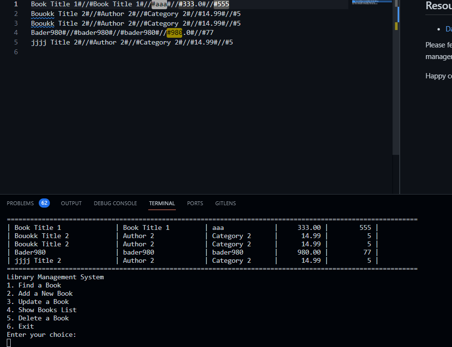

# Library Inventory Management using Dart

This project focuses on managing a library's book inventory and related operations using Dart programming. The `clsLibrary` class serves as a key component for managing and interacting with the library's books.

## Project Overview

The `clsLibrary` class is part of a larger project that aims to provide efficient management of a library's book inventory through various features, including adding, deleting, updating, and querying books. Here's an overview of the key components:

### Class Structure

- The `clsLibrary` class extends `ClsBook` and is responsible for managing book-related operations.
- It defines three main modes of operation: `EmptyMode`, `UpdateMode`, and `AddNewMode`.
- Book data, such as title, author, category, price, quantity, and deletion status, are maintained as class attributes.

### Features

1. **Conversion Methods**: The class includes methods for converting lines of book data to library objects and vice versa.

2. **File Operations**: It can read book data from a file named 'Books.txt' and save book data to the same file. This includes appending new book data and updating existing book records.

3. **Data Manipulation**: The class allows for updating book data, adding new books, and marking books for deletion. It handles error checking for invalid inputs.

4. **Querying Books**: Books can be queried by title, author, or category using the `Find` and `findByCategory` methods.

5. **Validation**: The class checks for the existence of a book before adding a new one.

## Getting Started

To explore and use the `clsLibrary` class and related project, follow these steps:

1. Clone this repository to your local machine.

2. Ensure you have Dart installed on your system. If not, refer to the official Dart website for installation instructions: [Dart](https://dart.dev/).

3. Open the project in your preferred Dart development environment.

4. Use the class and its methods to interact with the library's book inventory. You can query, add, update, or delete books as needed.

5. Ensure you have a 'Books.txt' file in the project directory or update the file path accordingly in the code.

## Evaluation and Improvement

This project can be evaluated based on various criteria, including code quality, adherence to programming concepts, and functionality. The project aims to provide a solid foundation for managing a library's book inventory, and you can further enhance and expand its features based on your requirements.

## Resources

- [Dart Programming Language](https://dart.dev/)

Please feel free to make improvements, add more features, or adapt the code for your specific library management needs.

Happy coding!
